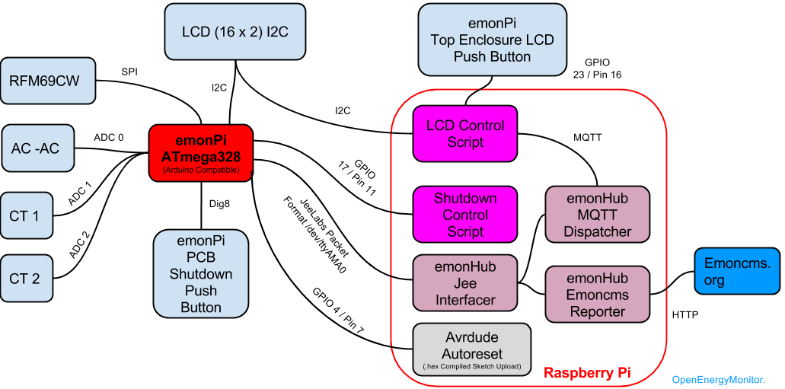

emonPi
======

emonPi - Raspberry Pi Energy Monitoring Unit

## Overview: 
http://openenergymonitor.org/emon/modules/emonPi

## Technical Wiki:
http://wiki.openenergymonitor.org/index.php?title=EmonPi

Technical description of emonpi software stack: [https://github.com/openenergymonitor/emonpi/blob/master/software.md](https://github.com/openenergymonitor/emonpi/blob/master/software.md)

## Hardware: 
https://github.com/openenergymonitor/hardware/emonpi

## Development Thread: 
http://openenergymonitor.org/emon/node/3937
