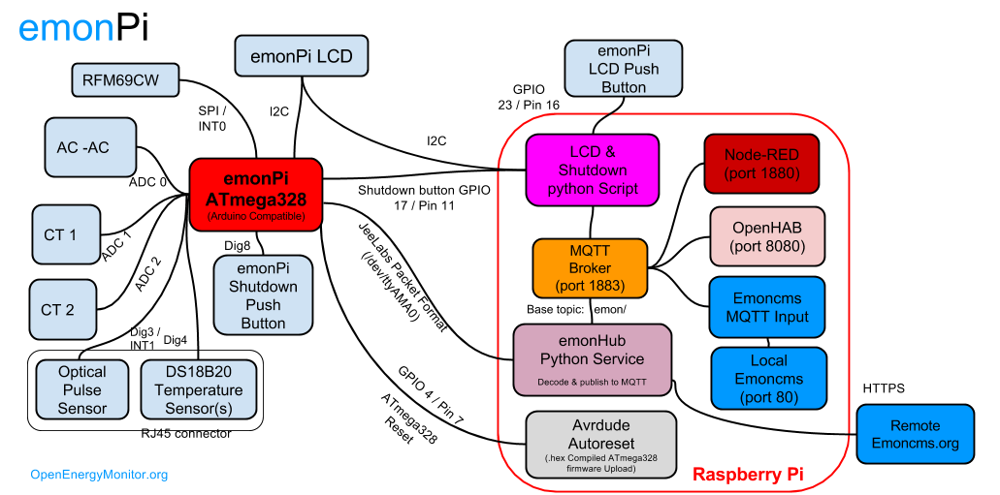

# emonPi

[](https://travis-ci.org/openenergymonitor/emonpi)

## Raspberry Pi based energy Monitoring Unit




## Purchase

- [Online Shop](https://shop.openenergymonitor.com/emonpi-2/)

## User guide

- [Setup Guide](https://guide.openenergymonitor.org/)

- [emonSD pre-built SD card image download](https://github.com/openenergymonitor/emonpi/wiki/emonSD-pre-built-SD-card-Download-&-Change-Log)


## Technical:

- [Technical Overview](https://guide.openenergymonitor.org/technical)

- [Hardware Technical Wiki](http://wiki.openenergymonitor.org/index.php?title=EmonPi)


## Open-Hardware:

- [Schematic & Board CAD Design Files](https://github.com/openenergymonitor/emonpi/tree/master/hardware)

## Community & Support

- [OpenEnergyMonitor Forums](https://community.openenergymonitor.org//)

OpenEnergyMonitor Shop Support: support@openenergymonitor.zendesk.com

## License

- The hardware designs (schematics and CAD files) are licensed under a Creative Commons Attribution-ShareAlike 3.0 Unported License.
- The firmware is released under the GNU GPL V3 license The documentation is subject to GNU Free Documentation License
- The hardware designs follow the terms of the OSHW (Open-source hardware) Statement of Principles 1.0.

## Disclaimer

```
OUR PRODUCTS AND ASSEMBLY KITS MAY BE USED BY EXPERIENCED, SKILLED USERS, AT THEIR OWN RISK. TO THE FULLEST EXTENT PERMISSIBLE BY THE APPLICABLE LAW, WE HEREBY DISCLAIM ANY AND ALL RESPONSIBILITY, RISK, LIABILITY AND DAMAGES ARISING OUT OF DEATH OR PERSONAL INJURY RESULTING FROM ASSEMBLY OR OPERATION OF OUR PRODUCTS.

Your safety is your own responsibility, including proper use of equipment and safety gear, and determining whether you have adequate skill and experience. OpenEnergyMonitor and Megni registered partnership disclaims all responsibility for any resulting damage, injury, or expense. It is your responsibility to make sure that your activities comply with applicable laws, including copyright. Always check the webpage associated with each unit before you get started. There may be important updates or corrections. All use of the instructions, kits, projects and suggestions given both by megni.co.uk, openenergymonitor.org and shop.openenergymonitor.org are to be used at your own risk. The technology (hardware , firmware and software) are constantly changing, documentation (including build guide and instructions) may not be complete or correct.

If you feel uncomfortable with assembling or using any part of the system, return it to us for a full refund.
```
