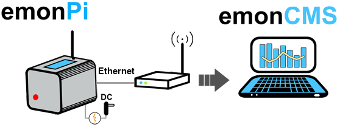
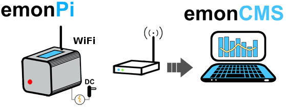
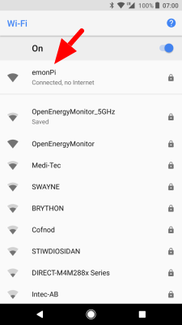
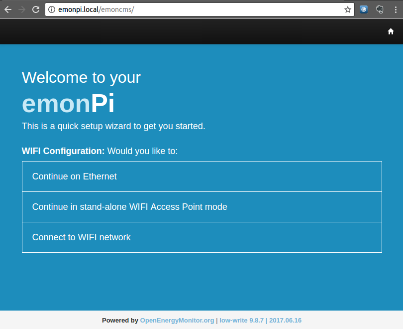
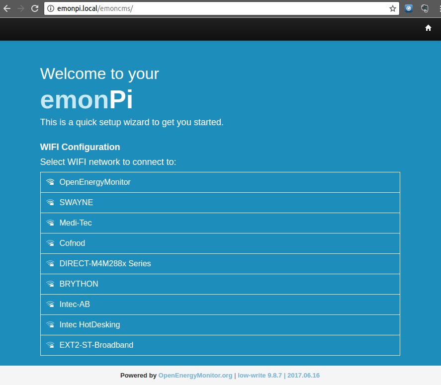
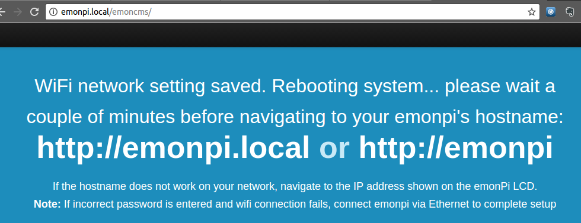
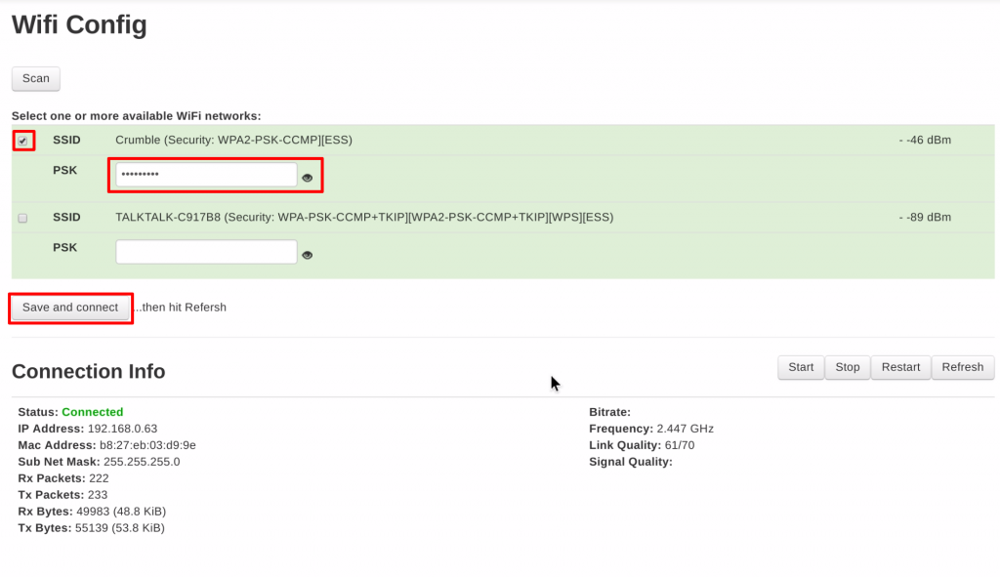

# Connect

The software running on both the emonPi and emonBase SD card is the same. We have created a pre-built image which we call *emonSD* with everything in place to support both local and remote data logging with Emoncms.

This guide walks through connecting an emonPi or emonBase running the emonSD software to your local network or/and the wider internet with either WiFi, Ethernet or 3G GSM Dongle. If you do not wish to connect to a network it is also possible to access the emonPi and emonBase user interface in stand-alone access point mode.

If you are building your own RaspberryPi base station the emonSD image is available to download here: [Pre-build SD card download & Change Log](../emonsd/download.md). The SD card can also be [purchased from the shop](http://shop.openenergymonitor.com/pre-loaded-emonsd-microsd-card-for-raspberry-pi/).

## Option 1: Connecting via Ethernet

Where possible we recommend connecting via Ethernet for best reliability and ease of setup. To ensure that your emonPi/emonBase does not start a WiFi access point on first boot, connect up the Ethernet cable between the emonPi/emonBase and internet router first and then power up the unit.

*Note to self-build users: To ensure that the Pi has enough power a [2.0A USB power adapter is recommended, 2.5A ideal](http://shop.openenergymonitor.com/power-supplies/).*

**emonPi:** The LCD display will display the firmware version then scan for connected sensors. Once the Raspberry Pi has booted up, the LCD will display the IP address of the emonPi on the local network:

*Take care to connect the Ethernet to the socket on the same side as the USB sockets, not the RJ45 connector on the opposite side.*

**emonBase:** Without the LCD Display we have to rely on either the hostname or network discovery tools to find the EmonBase on the network. Try browsing to the hostname: http://emonpi, http://emonpi.local or http://emonpi.lan. 

You should now see the emoncms user login page. Register a new account and then continue to the next step [Log Locally](../emoncms/intro-rpi.md) to configure your system.

If the hostname does not work, it is usually possible to find a list of devices and their IP address's on your internet router. Alternatively Network Discovery tools such as Fing work well. Download [Fing Android](https://play.google.com/store/apps/details?id=com.overlook.android.fing&hl=en_GB) or [Fing iOS](https://itunes.apple.com/gb/app/fing-network-scanner/id430921107?mt=8).

**UPDATE HIGHLY RECOMMENDED:** Now your emonPi/emonBase is connected to a network this would be a good time to pull in any new updates: `Setup > Admin > Update`

## Option 2: Connecting via WiFi

- Connect 5V USB power [(2A USB power adapter recommended, 2.5A ideal)](http://shop.openenergymonitor.com/power-supplies/)
- After a couple of minutes the emonPi/emonBase will broadcast a Wifi access point (AP) called `emonsd` with password `emonsd2022` (If you are using an image older than `emonSD-10Nov22`, please refer to this dropdown list to find the correct credentials for your install: https://docs.openenergymonitor.org/emonsd/download.html#emonsd-download).

emonSD-10Nov22 SSID

*Note: Please be patient, it can take a number of minutes to start broadcasting an a WiFi AP at startup. The LCD will display `WiFi: YES 0% 192.168.42.1` once the WiFi AP is active.*

- Connect to `emonPi` WiFi network then either browse to hostname: [http://emonpi](http://emonpi) or [http://emonpi.local](http://emonpi.local) or IP address [http://192.168.42.1](http://192.168.42.1)
- emonPi network setup wizard should now be displayed:

- Follow setup wizard to connect to local WiFi network:

*Note: If required emonPi can operate in Wifi AP mode without any network connection. If operating in AP mode use of a [RTC (real-time-clock)](modifications.md) is highly recommended to keep system time.*

**Please be patient, scanning for networks can take a while**

- After selecting local WiFi network and entering password the emonPi will turn off its own WiFi AP then reboot and try and connect to local WiFi network.

*Note: if connection fails e.g. incorrect password, follow instructions 1b to connect temporary via Ethernet and use the Emoncms WiFi setup as detailed in step 4*

- After a couple of minutes attempt to connect to your emonPi/emonBase via it's hostname: [http://emonpi](http://emonpi), [http://emonpi.local](http://emonpi.local) or [http://emonpi.lan](http://emonpi.lan).

- emonPi: If hostname does not work on your network, enter the IP address shown on the LCD into your browsers address bar
- *If using an emonBase and hostname does not work, look up its IP address from your router or use the Fing Network Discovery tool on [Android](https://play.google.com/store/apps/details?id=com.overlook.android.fing&hl=en_GB) and [iOS](https://itunes.apple.com/gb/app/fing-network-scanner/id430921107?mt=8)*.

You should now see the emoncms user login page. Register a new account and then continue to the next step [Log Locally](../emoncms/intro-rpi.md) to configure your system.

## Option 3: Connect to Ethernet and then configure Wifi

An alternative approach to WiFi setup is to connect first using Ethernet and then use the Emoncms WiFi module to configure the WiFi connection. Start by following the Ethernet steps above. Create an emoncms account, login and navigate to **Setup > WiFi**:

Network scan should happen automatically and show the available WiFi networks:

Check the box to select the network(s) you want to connect to. Enter the PSK password and then click `Save and Connect`.

After a few seconds 'Connection Info' should refresh automatically to report `Status: Connected` and after a few more seconds the IP address should appear.

## Advanced: Assign static 

If local static IP address is required the easiest way is to allow IP address to be given via DHCP then fix the IP address on the router. Not all routers support this.

Alternatively to set a static IP address on the emonPi itself connect via SSH and edit /etc/network/interfaces. E.g the following commands will SSH into emonPi, create backup of the interfaces file then setup a static IP on Ethernet. For WiFi change eth0 to wlan0.

    ssh pi@192.168.X.X
    sudo cp /etc/dhcpcd.conf /etc/backup_dhcpcd.conf
    sudo nano /etc/dhcpcd.conf

Append to the end of dhcpcd.conf (change to suit your network and interface required static IP):

    interface eth0
    static ip_address=192.168.0.10/24
    static routers=192.168.0.1
    static domain_name_servers=192.168.0.1

    interface wlan0
    static ip_address=192.168.0.200/24
    static routers=192.168.0.1
    static domain_name_servers=192.168.0.1

    [CTRL + X] then Y to save and exit nano
    sudo reboot

[For more info see Tutorial - How to give your Raspberry Pi a Static IP Address](http://www.modmypi.com/blog/tutorial-how-to-give-your-raspberry-pi-a-static-ip-address)

If required the changes above to dhcpcd.conf can be made by inserting the SD card into a Linux computer and editing the file directly if working offline.

