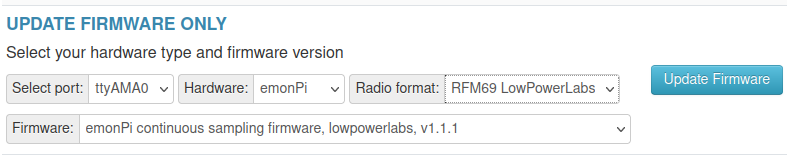

# Firmware

The emonPi firmware is based on Arduino.

## Available Firmware

### [emonPi_CM](https://github.com/openenergymonitor/emonpi/tree/master/firmware/emonPi_CM): continuous sampling firmware

**New 16th Feb 2023:** This firmware provides higher accuracy continuous monitoring. Continuous monitoring means that the power readings are representative of the full 10s period that they represent rather than a short snapshot. Support for radio formats: JeeLib Native and **LowPowerLabs (recommended)**.

### [emonPi_DS_jeelib_classic](https://github.com/openenergymonitor/emonpi/tree/master/firmware/emonPi_DS_jeelib_classic): discrete sampling firmware

The original emonPi firmware, this performs power measurement in short discreet snapshots ~300ms long per CT channel at 50Hz per 10s period. Compatible with the original jeelib classic radio format.

## Updating firmware directly from the emonPi user interface

The easiest way of updating the emonPi firmware is to use the firmware upload tool available at `Setup > Admin > Update > Firmware`.

Select port: `ttyAMA0` and Hardware: `emonPi`. Then depending on which firmware variant you wish to upload as described above select the radio format and firmware as required.

Click `Update Firmware` to upload the firmware.

## How to compile and upload firmware

It is also possible to compile and upload the emonPi firmware (Instructions need to be added here on how to compile and upload directly on an emonPi).

### PlatformIO Command Line

PlatformIO works great from the command line. See the excellent [PlatformIO Quick Start Guide](https://docs.platformio.org/en/latest/core/installation/index.html#super-quick-mac-linux) for installation instructions.

**Compile and upload emonPi_CM Continuous Sampling firmware**

    git clone https://github.com/openenergymonitor/emonpi
    cd emonpi/firmware/emonPi_CM
    pio run
    
**Compile and upload emonPi_DS_jeelib_classic Discrete Sampling firmware**

    git clone https://github.com/openenergymonitor/emonpi
    cd emonpi/firmware/emonPi_DS_jeelib_classic
    pio run

**View serial port with PlatformIO CLI**

    pio device monitor
