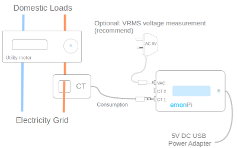
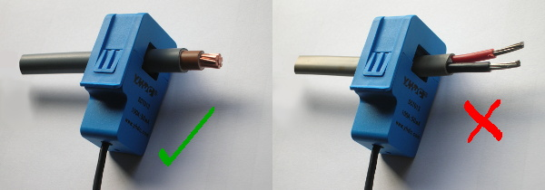
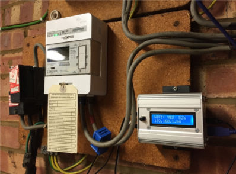
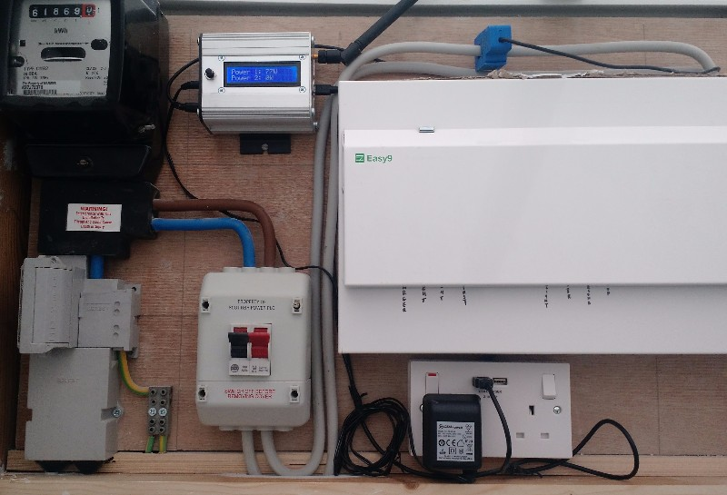

# EmonPi Install Guide

The following guide provides an quick overview of how to setup the hardware part of an emonPi energy monitoring system for monitoring up to two AC circuits.




```{warning}
[Please read the CT installation guide before installing.](../electricity-monitoring/ct-sensors/installation)
Your safety is your responsibility. Clip-on current sensors are non-invasive and should not have direct contact with the AC mains. However, installing the sensors will require working in close proximity to cables carrying high voltage. As a precaution, we recommend ensuring the cables are fully isolated; i.e., switch off the power prior to installing your sensors and proceed slowly with care. If you have any doubts, seek professional assistance.
```

## 1. CT sensor

- Clip the CT sensor around either the **Line** or **Neutral** cable
- Connect jack plug into either CT1 or CT2 socket on the emonPi
- If the power reading is negative, reverse the CT sensor orientation
- CT sensor cable should not be extended to avoid induced noise
- For Solar PV install see [Solar PV Application page](../applications/solar-pv.md)
- [Learn more about how CT sensors work...](https://learn.openenergymonitor.org/electricity-monitoring/voltage-sensing/measuring-voltage-with-an-acac-power-adapter)

```{note}
The clip-on CT sensors must be clipped round either the Line or Neutral AC wire. **NOT BOTH**
```



## 2. AC-AC Adapter

- Plug the AC-AC adapter into a power outlet
- This may require installation of a new outlet or extending an existing one
- AC-AC adapter cable can be extended if required
- Plug power connector into the AC socket on the emonPi
- Essential for [Solar PV monitoring](../applications/solar-pv.md)
- Provides AC waveform reference for accurate Real Power measurements.
- [Learn more about measuring voltage with AC-AC power adapator...](https://learn.openenergymonitor.org/electricity-monitoring/voltage-sensing/measuring-voltage-with-an-acac-power-adapter)

## 3. DC 5V USB Adapter

- Plug the DC 5V USB adapter into a power outlet
- Plug the mini-B USB connector into the emonPi
- High quality minimum [1.2A power supply recommended](https://shop.openenergymonitor.com/power-supplies/)

## 4. Optical Utility Meter LED Pulse Sensor (optional)

- See [Optical Pulse Sensor setup page](https://guide.openenergymonitor.org/setup/pulse-counting/)
- Connects to emonPi / emonTx via RJ45 connector
- Self-adhesive velcro attachment to utility meter
- One optical pulse sensor per emonPi/emonTx
- Can be used in conjunction with temperature sensors using [RJ45 Breakout](http://shop.openenergymonitor.com/rj45-expander-for-ds18b20-pulse-sensors/)

## 5. Temperature Sensors (optional)

- Connect to emonPi / emonTx via RJ45 connector.
- Up to 6x [RJ45 sensors](https://shop.openenergymonitor.com/rj45-encapsulated-ds18b20-temperature-sensor/) can be connected using the [RJ45 expander](http://shop.openenergymonitor.com/rj45-expander-for-ds18b20-pulse-sensors/).
- Up to 6x [wired sensors](https://shop.openenergymonitor.com/encapsulated-ds18b20-temperature-sensor/) can be connected using the [terminal block breakout board](https://shop.openenergymonitor.com/rj45-to-terminal-block-breakout-for-ds18b20/).
- Sensor wire can be extended using RJ45 cable and the [RJ45 Extender](http://shop.openenergymonitor.com/rj45-extender/).

## 6. Installation Examples





The included clips can be used to mount the emonPi / emonTx on a wall. 

See [Solar PV Application Note](/applications/solar-pv/) for emonPi solar PV install guide & images.

## 7. Power Up

```{note}
Ensure all sensors are connected before powering up.
```

a.) **Switch on DC & AC power**

b.) **Check CT sensor(s) & AC Wave are detected:**


c.) **emonPi should remember WiFi network and re-connect**


## 8. Shutdown

Optional: Shut down the emonPi, hold down the shutdown button for 5 seconds, then wait 30 seconds for unit to fully shut down.


```{warning}
Unplugging power from the emonPi without following the correct shutdown procedure can result in a corrupted SD card.
```

## 9. Video Guide
<div class='videoWrapper'>
<iframe width="560" height="315" src="https://www.youtube.com/embed/6SB4fRYQjno" frameborder="0" allowfullscreen></iframe>
</div>
