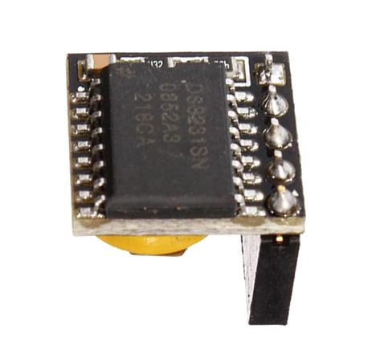
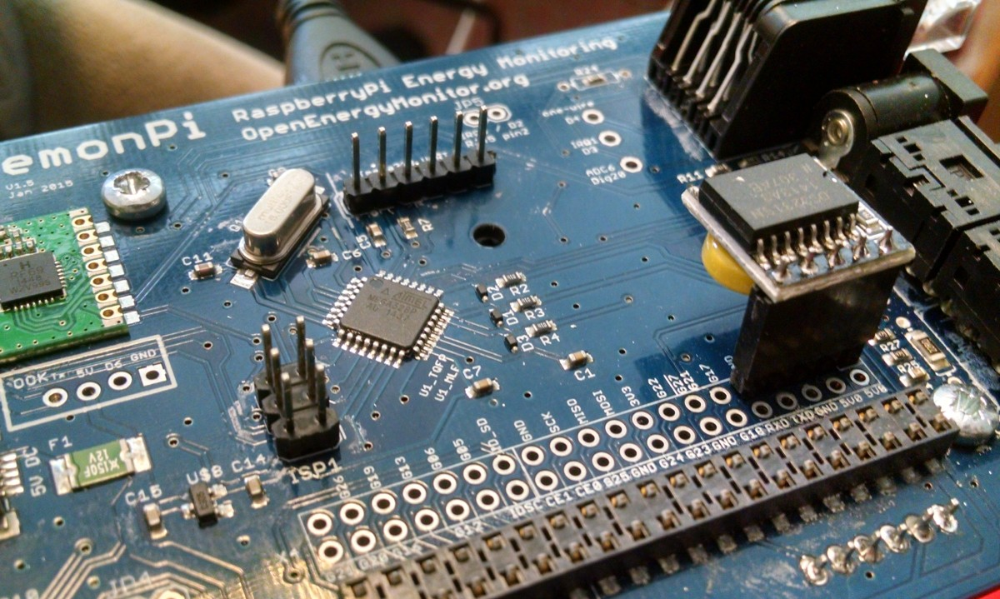
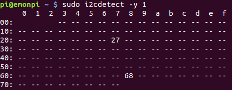
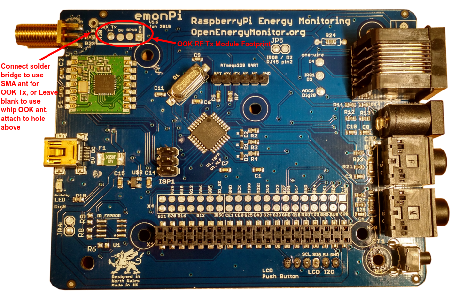

# Modifications

## Adding a Real Time Clock (RTC)

The emonPi updates its internal linux time via NTP when connected to the internet. However, if the emonPi is used in an offline network, or an accurate time stamp is essential, a hardware Real Time Clock (RTC) can easily be added to the Pi's GPIO. We have tested using a [DS3231 based RTC module](http://thepihut.com/products/mini-rtc-module-for-raspberry-pi). This RTC module communicates  with the emonPi via I2C, it can be easily connected as follows by soldering a five-pin header onto the emonPi aux GPIO pins: 

Once connected, check it's detected on the I2C bus by running:

    sudo i2cdetect -y 1

If the RTC is successfully detected it should return the following: 

**0x27** is the emonPi's I2C LCD display and 0x68 is the RTC module.

To setup the DS3231 RTC:

    git clone https://github.com/Seeed-Studio/pi-hat
    cd pi-hats/tools
    sudo ./install.sh -u rtc_ds3231
    sudo reboot

When the RTC has been successfully installed, the output of `sudo i2cdetect -y 1` should show "UU" insted of "68" that is showed previously before the RTC was installed.
 
Read hardware clock and print result

    sudo hwclock -r

Set the system time from the hardware clock

    sudo hwclock -s

Set the hardware clock from the current system time

    sudo hwclock -w

Access help for more usage

    hwclock --help

## LightWaveRF OOK

*Guide below copied for posterity from old wiki, we havent tried this for some time and the steps below may need modification to work on more recent emonSD images.*

[OOK (On-Off-Keying)](http://en.wikipedia.org/wiki/On-off_keying) is a simple RF modulation commonly used by RF controled remote plugs. With the addition of a OOK module the emonPi can be used to control RF plugs. 

This documentation is focused on controlling LightWaveRF plugs & dimmers however it would possible to control other OOK plugs with the correct protocol e.g FS20. The LightWaveRF OOK protocol has been reverse engineered and open-sourced. 

There is a development comunity at [http://lightwaverfcommunity.org.uk](http://lightwaverfcommunity.org.uk).

Thanks to [Lawrie Griffiths](https://github.com/lawrie)/[Geek Grandad blog](https://geekgrandad.wordpress.com) for creating [LightWaveRF Arduino library](https://github.com/lawrie/LightwaveRF) and porting it to [Raspberry Pi with MQTT service](https://github.com/openenergymonitor/lightwaverf-pi). 

The OOK transmitter footprint is (from left to right): ANT, 5V, D6 + (on emonPi V1.6 GPIO18 / Pin 12), GND.

The OOK transmitter data line is connected to Dig 6 of ATmega328 and on current rev of emonPi (V1.6 - sold since Nov 2015) the OOK is also be connected directly to to GPIO 18 (pin 12) and the antenna connection of the OOK module can be jumpered to share the main SMA emonPi antenna.

OOK Tx module footprint on emonPi V1.6:

OOK Tx module hacked onto the older emonPi V1.5 (sold pre Nov 2015), the white wire connects to OOK RF antenna to the SMA antenna. A separate antenna could be used. The red wire connects the OOK Data pin to GPIO 18 (labeled G18):

Installation (process needs review):

    git clone https://github.com/lawrie/lightwaverf-pi.git
    cd lightwaverf-pi
    make
    sudo make install
    sudo service lwrfd start
    sudo update-rc.d lwrfd defaults

LWRF plugs can be controlled by publishing to 'lwrf' MQTT topic. 

The message format is `<channel> <command> [<level>]`, where channel is 1-16, command is 0-2 (2 means mood), and level is 0-31 (used for dimmers).

E.g publishing “1 1” to 'lwrf' topic turns channel 1 on and “1 0” turns it off. 

Plugs can be paired with the emonPi in the usual LightwaveRF way: Either press and hold pairing button (if button exists) or turn on the plug from main power and send 'on' command. Most LightWaveRF plugs allow multiple (up to 6) control devices to be paired. 

To reset the plug and delete all pairing, press and hold the pairing button to enter pairing mode, then press and hold again to erase memory. Then press (don't hold) once to confirm. For plugs without a pairing button, turn on the plug from the mains power, then in the first few seconds, press the 'all off' button on the RF remote. 

**Emulate Remote**

The LightWaveRF Pi MQTT emulates a LightWaveRF remote with the following default ID: `byte id[] = {0x6f,0xed,0xbb,0xdb,0x7b,0xee};`. If you want to be able to control your plugs with either YOUR LightWaveRF remote or the emonPi you will need to capture the unique ID of your remote. To do this you will need an [OOK receiver module](http://uk.rs-online.com/web/p/lower-power-rf-modules/6172044) and an Arduino running the [lwrf receive sketch](https://github.com/lawrie/LightwaveRF/tree/master/examples/lwreceive). The ID is the last 6 bytes of the transmission. Once captured replace the ID in [mqrfmqtt.c](https://github.com/lawrie/LightwaveRF/tree/master/examples/lwreceive) with your remote's ID then recompile (make, sudo make install).

