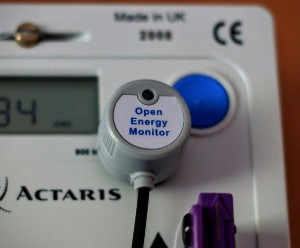
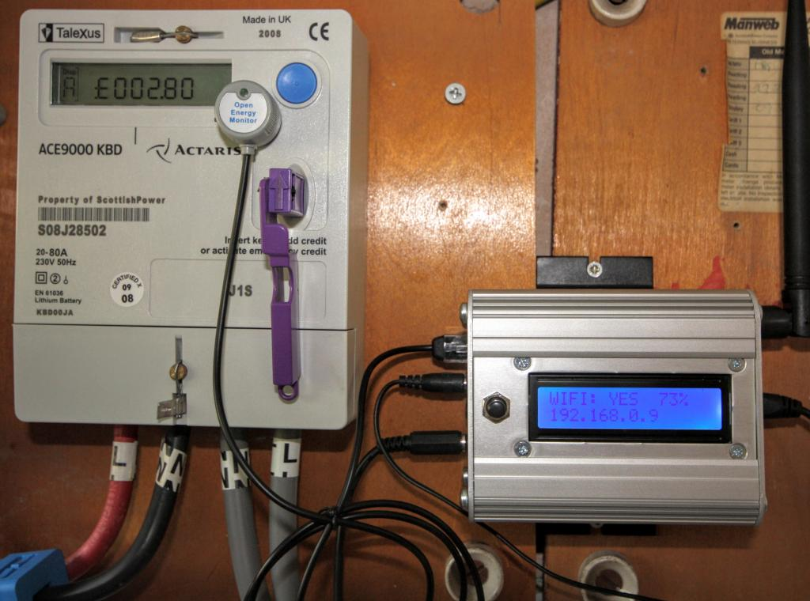
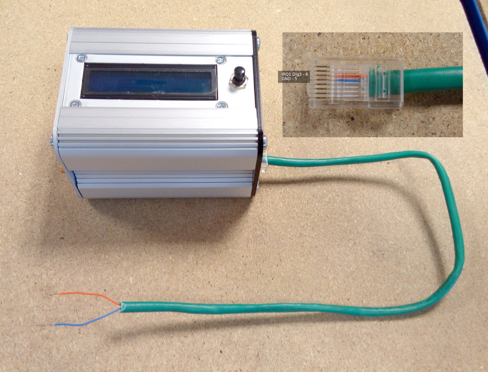

# Pulse counting



Many meters, including single phase, 3-phase, import and export electricity meters, gas meters, water meters and heat meters, have pulse outputs. The pulse output may be a flashing LED or a relay (typically solid state) or both.

Using an Optical Pulse Sensor it is possible to detect the LED / IR 'pulse' output from a utility meters. Meters with wired pulse outputs can be connected directly with two wires and usually switch a voltage provided by the monitoring hardware.

In the case of an electricity meter, a pulse output corresponds to a certain amount of energy passing through the meter (kWh/Wh). For single-phase domestic electricity meters e.g. Elster A100c, each pulse typically corresponds to 1 Wh (1000 pulses per kWh). Water and gas meters will usually be marked to show the quantity of water (litres/gallons) or gas (cubic meters/cubic feet) that each pulse represents.

- The emonPi has one spare interrupt pulse input as standard (IRQ 1, Dig3) which can be used for pulse counting.
- This pulse input is accessible via the RJ45 socket.

Unlike clip-on CT based monitoring, pulse counting is measuring exactly what the utility meter is measuring i.e. what you get billed for. Pulse counting cannot provide an instantaneous power reading like clip on CT sensors can. It is often worthwhile using pulse counting in conjunction with clip on CT sensors to get the best of both techniques.

The emonPi can simultaneously perform pulse counting and CT based monitoring.

```{note}
Some meters are configured to pulse on both import and export. If your meter is, and you use it for both (e.g. an import meter on a property with grid-connected Solar PV) then you will have difficulty making good use of an optical pulse sensor, as it will not agree with either the meter reading or any CT sensor measurement.

One possibility is to use the sign (positive or negative) of the output of a CT sensor attached to the meter's input (or output) to distinguish between positive and negative pulses. You can then either reject negative pulses, or count them separately if you wish.

<a href="https://community.openenergymonitor.org/t/large-discrepancy-between-pulse-counter-and-ct/10561">This community forum discussion</a> contains more information on how to do this.
```

## Option 1: Using an Optical pulse sensor



```{warning}
It is advisable to shield the sensor and the meter from bright light as this can adversely affect readings.
```

1. Identify your utility meter's pulse output, usually a red flashing LED marked 'kWh'. Stick the sensor over the LED, carefully aligning the hole so the flashing LED shines through clearly. Be sure to clean any dust from the meter face before attaching the sensor.

2. Plug sensors RJ45 connector into emonPi / emonTx RJ45 socket.

```{warning}
Ensure the sensor is plugged into the RJ45 socket on the emonPi on the same side as the CT connection jack-plug sockets NOT the Etherent socket.
```

If installed correctly when the emonPi / emonTx is powered up the pulse sensor LED should flash in sync with the utility meter LED. See video clip:

*You may need to switch on a large electrical load e.g. kettle to generate some pulses*

<div class='videoWrapper'>
<iframe width="560" height="315" src="https://www.youtube.com/embed/vq5EmMRrOY0" frameborder="0" allowfullscreen></iframe>
</div>

*Note: If the pulsecount value in emoncms does not increase in line with LED flashes, it maybe that there is light from another source interfering with the pulse detection. Some meters have a plastic cover that makes it quite hard to keep external light away from the pulse sensor. See forum thread [here](https://community.openenergymonitor.org/t/first-try-with-emonpi-pulsecount-stuck-at-1/7375) for more details.*

## Option 2: Wired pulse counting

To connect to a meter with a wired pulse output it's possible to either wire the pulse output cable directly to a RJ45 passthrough connector or to a RJ45 to terminal block adapter. The screenshot below shows an example with a simple RJ45 passthrough connector.

**RJ45 Pinout**<br>
The RJ45 implements a standard pinout used by other manufacturers of DS18B20 temperate sensing hardware such as Sheepwalk Electronics.



