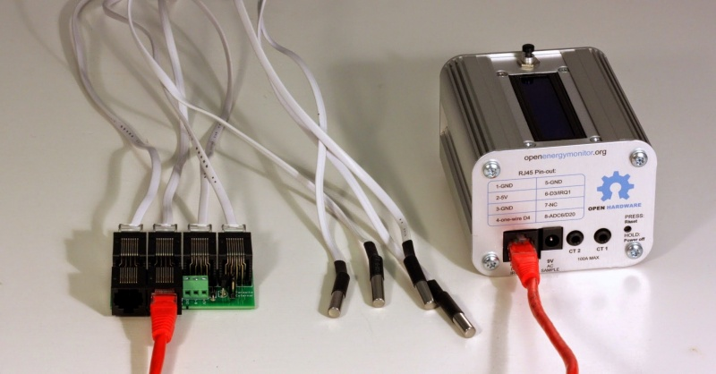
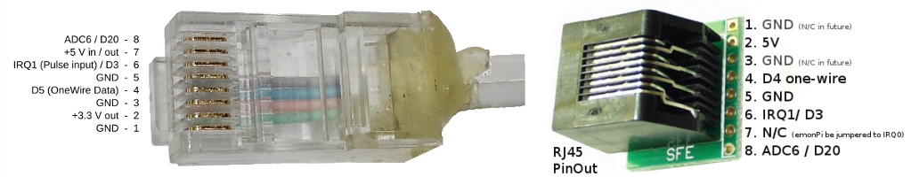

# Temperature sensing

The emonPi supports temperature sensing using DS18B20 one-wire digital temperature sensors. The standard firmware on the emonPi supports up to 6x temperature sensors.

The emonPi has a special RJ45 socket to which either a single RJ45 DS18B20 temperature sensor can be connected directly or multiple sensors can be connected via either a RJ45 breakout board or terminal block breakout board. 

## Example: 4x temperature sensors and a RJ45 breakout

- [Shop: RJ45 Encapsulated DS18B20 temperature sensor](http://shop.openenergymonitor.com/rj45-encapsulated-ds18b20-temperature-sensor/)
- [Shop: emonPi / emonTx RJ45 Expander for DS18B20 & Pulse Sensors](https://shop.openenergymonitor.com/rj45-expander-for-ds18b20-pulse-sensors/)
- [An RJ45 coupler can be used to extend RJ45 sensor cables.](http://www.sheepwalkelectronics.co.uk/product_info.php?cPath=26&products_id=36)

## RJ45 Pinout

The RJ45 implements a standard pinout used by other manufacturers of DS18B20 temperate sensing hardware such as Sheepwalk Electronics.

*Note: The RJ45 socket does not support power supply switching via Dig19 (ADC5) as described above.*

## Further reading

If you are using temperature sensors with heating systems such as heat pumps the following blog post by John Cantor provides a number of useful mounting suggestions: [John Cantor's Blog: Temperature sensors for monitoring heat pumps](https://heatpumps.co.uk/2015/06/08/temperature-sensing-with-openenergymonitor)
