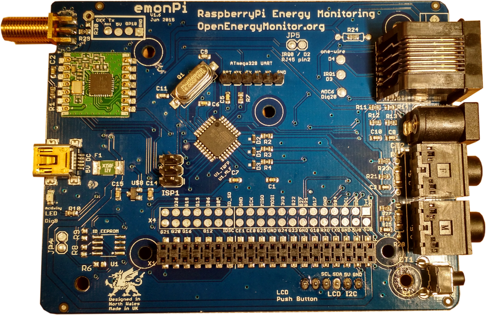
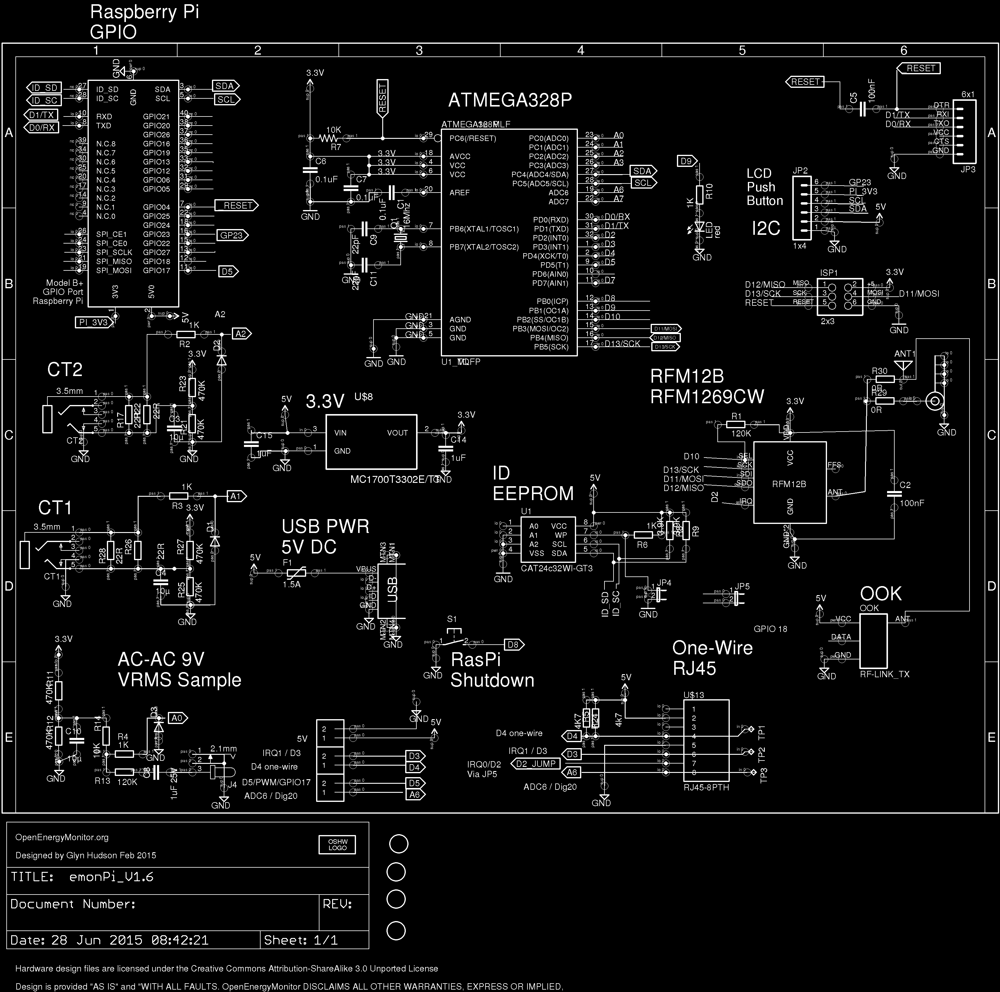
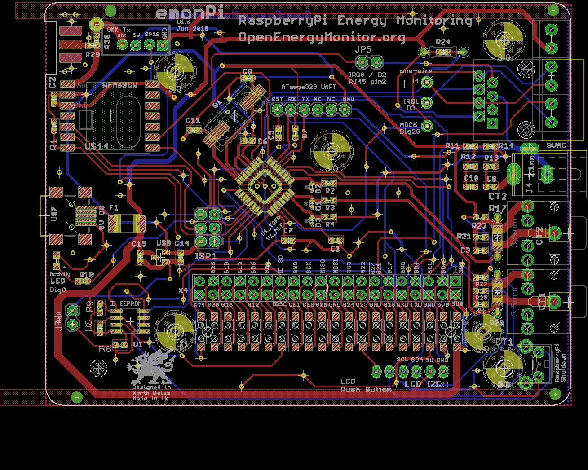

## emonPi V1.6

**Raspberry Pi Energy Monitoring Shield**

Technical Documentation: [http://wiki.openenergymonitor.org/index.php?title=EmonPi](http://wiki.openenergymonitor.org/index.php?title=EmonPi)

emonPi Hardware Change Log: [http://wiki.openenergymonitor.org/index.php?title=EmonPi#Hardware_Change_Log](http://wiki.openenergymonitor.org/index.php?title=EmonPi#Hardware_Change_Log)

### Schematic

### Board

### Open Hardware

Hardware designs (schematics and CAD) files are licensed under the [Creative Commons Attribution-ShareAlike 3.0 Unported License](http://creativecommons.org/licenses/by-sa/3.0/) and follow the terms of the [OSHW (Open-source hardware) Statement of Principles 1.0.](http://freedomdefined.org/OSHW)
