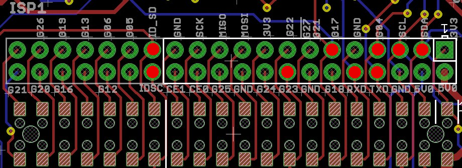
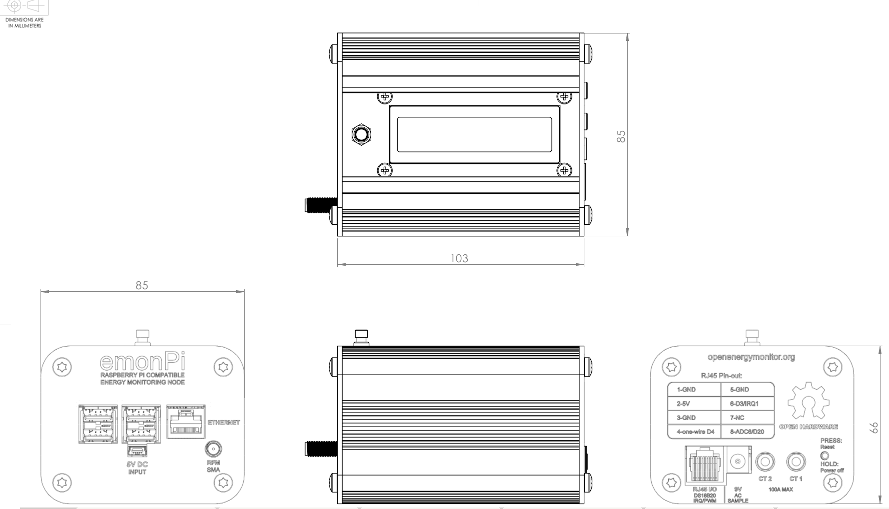

## emonPi V1.6

**Raspberry Pi Energy Monitoring Shield**

### Schematic

### Board

### Port Map

| Arduino Pin    | AVR Special Function  | emonPi V1.6 Atmega 328               | Raspberry Pi      |
|----------------|-----------------------|--------------------------------------|-------------------|
| Analog 0 (D14) |                       | AC Voltage                           |                   |
| Analog 1 (D15) |                       | CT1                                  |                   |
| Analog 2 (D16) |                       | CT2                                  |                   |
| Analog 3 (D17) |                       |                                      |                   |
| Analog 4 (D18) | (SDA)                 |                                      |                   |
| Analog 5 (D19) | (SCL)                 |                                      |                   |
| Analog 6 (D20) |                       | RJ45 pin 8 – ADC6 / Dig20            |                   |
| Analog 7 (D21) |                       |                                      |                   |
| Digital 0      | (RXD)                 | FTDI Tx                              | GPIO 14 / pin 8   |
| Digital 1      | (TXD)                 | FTDI Rx                              | GPIO 15 / pin 10  |
| Digital 2      | (int0) PWM            | RFM12B/69CW INT / (JP5 – RJ45 pin 7) |                   |
| Digital 3      | (int1) PWM            | RJ45 pin 6 – Pulse counter           |                   |
| Digital 4      |                       | RJ45 pin 4 – one-wire DS18B20        |                   |
| Digital 5      | PWM                   | Raspi GPIO 17 / Pin 11               | GPIO 17 / Pin 11  |
| Digital 6      | PWM                   | OOK Tx / (GPIO 18 -Pin 12) V1.6      |                   |
| Digital 7      |                       |                                      |                   |
| Digital 8      |                       | Shutdown PTM Button                  |                   |
| Digital 9      | PWM                   | emonPi PCB LED                       |                   |
| Digital 10     | (SS) PWM              | RFM69CW SEL                          |                   |
| Digital 11     | (MOSI) PWM            | RFM69CW SDI                          |                   |
| Digital 12     | (MISO)                | RFM69CW SDO                          |                   |
| Digital 13     | (SCK)                 | RFM69CW SCK                          |                   |

### Raspberry Pi GPIO

| Raspberry Pi GPIO  | RasPi Function  | emonPi V1.6 ATmega328                    |
|--------------------|-----------------|------------------------------------------|
| 2 (0 REV1)         | I2C             | SDA I2C LCD                              |
| 3 (1 REV 1)        | I2C             | SCL I2C LCD                              |
| 4 (pin 7)          |                 | ATmega328 reset                          |
| 7                  | SPI CS          |                                          |
| 8                  | SPI CS          |                                          |
| 9                  | SPI             |                                          |
| 10                 | SPI             |                                          |
| 11                 | SPI             |                                          |
| 14                 | UART Tx         | Dig 0 /Rx                                |
| 15                 | UART Rx         | Dig 1 / Tx                               |
| 17 (pin 11)        |                 | Atmega Dig 5 – shutdown signal           |
| 18 (pin 12)        |                 | OOK Tx (V1.6)                            |
| 22                 |                 |                                          |
| 23 (pin 16)        |                 | LCD PTM push button (High when pressed)  |
| 24                 |                 |                                          |
| 25                 |                 |                                          |
| 27 (21 REV 1)      |                 |                                          |

Red dots mark GPIO used by the emonPi: 

### Enclosure CAD Design

### Dimensions

PCB: 99.2mm x 76.1mm

Enclosure: 103mm x 85mm x 99mm

Enclosure Screws: Torx T20

Raspberry Pi fixing kit (Rapid Rapid numbers):

- 4 x 15mm spacer: 33-2040
- 4 x M3 screw: 33-2300

LCD fixing kit (Rapid Rapid numbers):

- 4 x 6mm spacer: 33-2034
- 4 x M3 lock Nut: 33-4402
- 4 x M3 12mm countersunk screw: 33-2955

### Open Hardware

Hardware designs (schematics and CAD) files are licensed under the [Creative Commons Attribution-ShareAlike 3.0 Unported License](http://creativecommons.org/licenses/by-sa/3.0/) and follow the terms of the [OSHW (Open-source hardware) Statement of Principles 1.0.](http://freedomdefined.org/OSHW)
