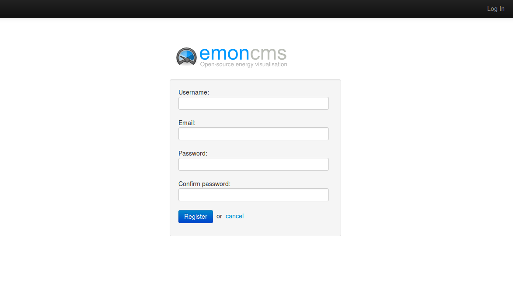
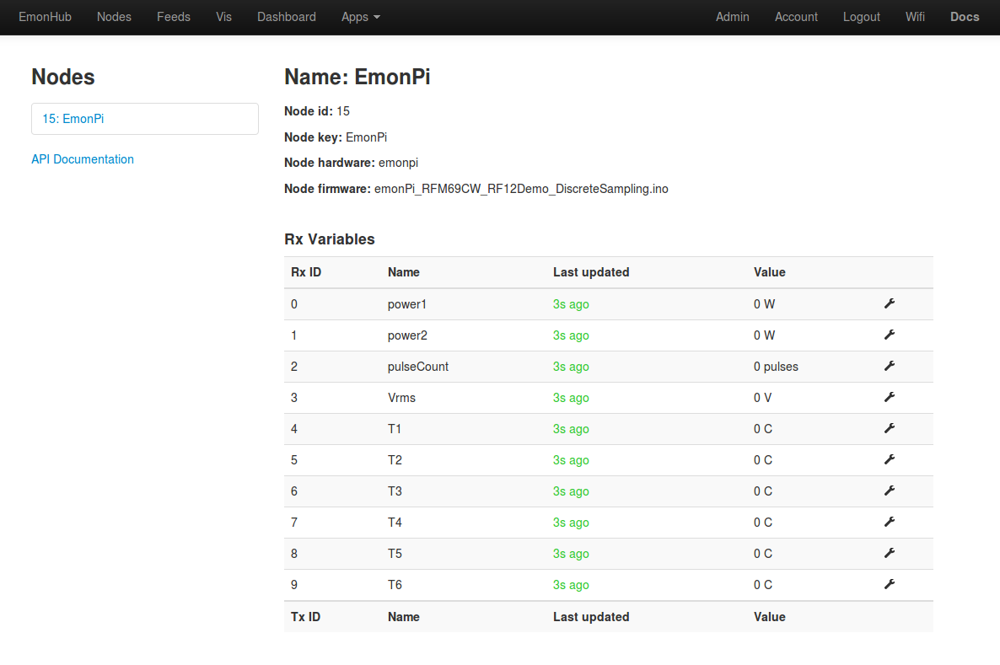
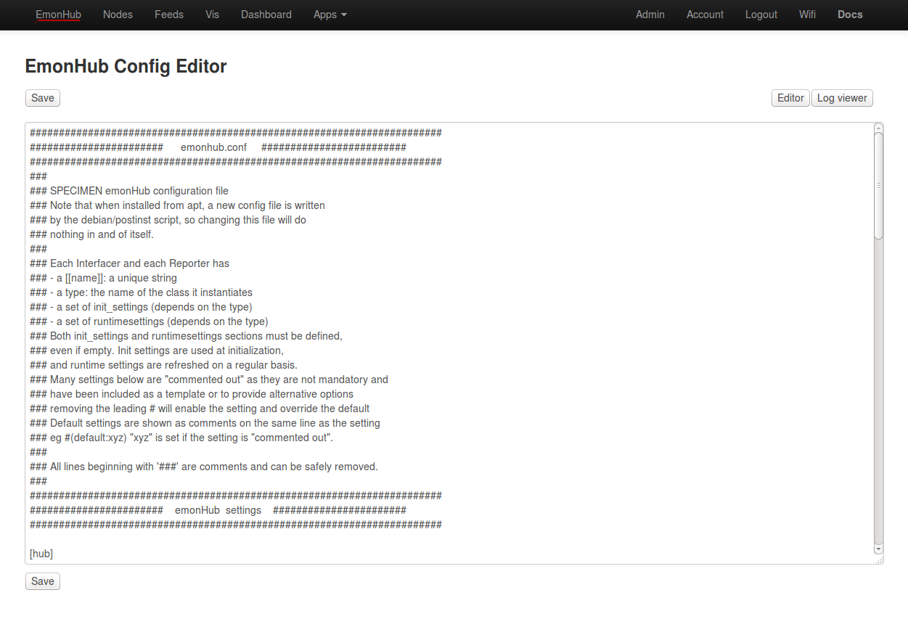
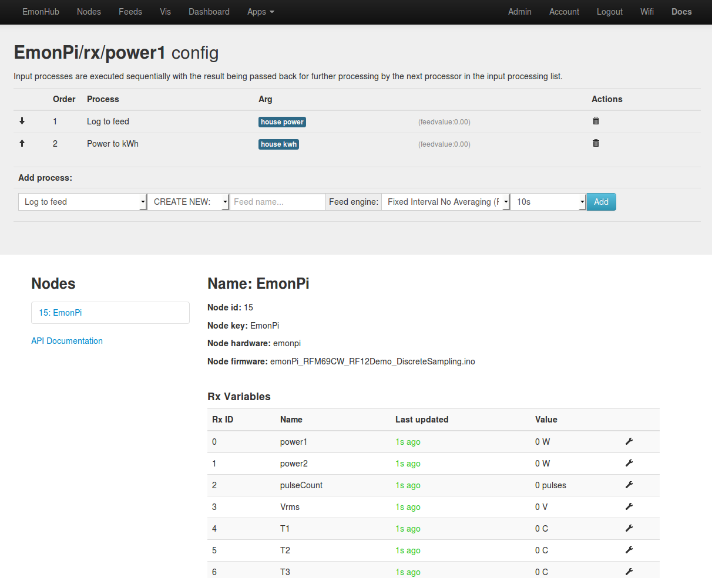
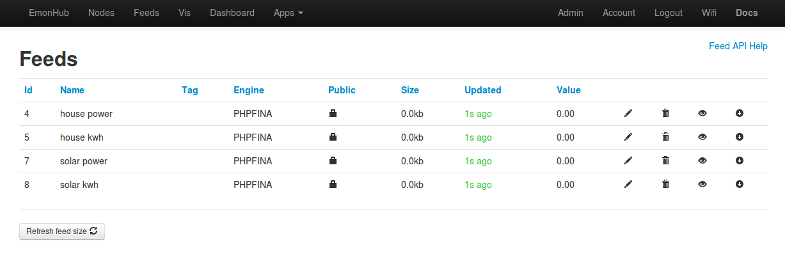

# Using the emonPi

The guide details how to use the emonPi, walking through setting up the software, accessing the emonPi measurement data, recording the data locally on the emonpi and forwarding the data to a remove server such as emoncms.org

Connect up 5V DC power via mini-USB socket (at least 1.2A adapter recomeded) and Ethernet to the emonPi, the emonPi LCD display will start by cycling through information about what is connected to the emonPi, how many CT current sensors, AC voltage measurement adatper and temperature sensors. This information is being provided by the ATmega328 microcontroller on the emonPi. Once the Raspberry Pi has booted up it will take over control of the LCD and show the status of Ethernet connectivity. With Ethernet connected it will show the IP address of the emonPi on your local network.

Enter the IP address shown in your web browser address bar.

This will bring up the emonPi Emoncms login. Select register to create a user, enter a username, email and password twice to create the administrator account.

    Development: create custom emonPi login without email address requirement, emonpi graphic and title, and automatic single account creation (automatically disable ability to create further accounts)

# NEED TO ADD DOCS TO SETUP WIFI

Once logged in you will see the user profile page on which you can change your username, password and other user settings. 

In the top navigation menu click on *Nodes* to bring up a live view of the emonpi measurement data *node 15* by default and any other nodes on the default RFM69 network (433Mhz, group 210). The emonPi data should refresh every 5 seconds.

Under the hood here we have data being sent in [JeeLabs RF12 Packet Format](http://jeelabs.net/projects/jeelib/wiki/RF12demo#Output-format) from the ATmega328 on the emonPi shield board to the Pi's internal serial port on the GPIO (/dev/ttyAMA0). On the Pi the data is read from the serial port and decoaded using a Python script called [emonHub](https://github.com/emonhub/emonhub/) and then forwarded using MQTT to the local installation of Emoncms which provides the GUI, data storage and visualisation. The important thing to note is that the information for decoding, scaling and naming the node data is stored in the emonhub.conf configuration file. emonHub also handles forwarding the data to a remote Emoncms server e.g [http://emoncms.org](http://emoncms.org)

The emonhub.conf configuration file can be accessed from within Emoncms by clicking on the EmonHub tab in the top menu. 

You can view the emonhub log using the in-browser log viewer, click on log viewer to bring up a snapshot of the emonhub log. This is useful for debugging. 

Click on refresh to load latest log entries.

**Nodes config**

Scrolling down to the bottom of the file you will see the node definition:

    [[15]]
        nodename = EmonPi
        firmware = emonPi_RFM69CW_RF12Demo_DiscreteSampling.ino
        hardware = emonpi
        [[[rx]]]
            names = power1,power2,pulseCount,Vrms,T1,T2,T3,T4,T5,T6
            datacode = h
            scales = 1,1,1,0.01,0.01,0.01,0.01,0.01,0.01,0.01
            units = W,W,pulses,V,C,C,C,C,C,C
            
If you wish to change the variable and node names, units or any of the other properties, change them here and click 'save'. The new configuration will then appear on the Nodes page within 5 seconds.

**emonPi RFM69 Radio config**

Near the top of emonhub.conf there is a section labeled RFM2Pi, The first part of the settings here specify the serial port to which the emonpi shield is connect and its baud rate. The second part contains the radio group, frequency and base node ID settings which can be changed if your radio module is an 868Mhz module or that you wish to use a different network group.

    ### This interfacer manages the RFM2Pi module
    [[RFM2Pi]]
        Type = EmonHubJeeInterfacer
        [[[init_settings]]]
            com_port = /dev/ttyAMA0
            com_baud = 38400
        [[[runtimesettings]]]
            pub_channels = ToEmonCMS,
            sub_channels = ToRFM12,
            
            # datacode = B #(default:h)
            # scale = 100 #(default:1)
            group = 210 #(default:210)
            frequency = 433 #(default:433)
            baseid = 15 #(default:15)
            quiet = false #(default:true)
            # interval = 300 #(default:0)
            # nodeoffset = 32 #(default:0)

### Sending data to emoncms.org, or other remote server

To send data to emoncms.org or other remote server add the following lines in the interfacers section of emonhub.conf. You will need your write apikey from the emoncms.org account you wish to post data too, enter the write apikey on the apikey line:

    [[emoncmsorg]]
        Type = EmonHubEmoncmsHTTPInterfacer
        [[[init_settings]]]
        [[[runtimesettings]]]
            pub_channels = ToRFM12,
            sub_channels = ToEmonCMS,
            url = http://emoncms.org
            apikey = YOUR EMONCMS WRITE APIKEY
            senddata = 1
            sendstatus = 0
            
**Note:** 'sendstatus' can be used to send a ping including your home WAN ip address every 60s to the emoncms myip module that's available under extra's in emoncms.org. This can be useful if your recording data locally and want to access your home pi remotely assuming port forwarding is enabled in your home router.
            
Click save and check using the emonhub log viewer if data is being sent and the response is an 'ok' from the remote emoncms server:

    2015-04-27 16:28:08,890 INFO     emoncmsorg sending: 
    http://emoncms.org/input/bulk.json?apikey=E-M-O-N-C-M-S-A-P-I-K-E-Y&data=[[1430152081,15,77,0,0,0,0,0,0,0,0,0],[1430152086,15,80,0,0,0,0,0,0,0,0,0]]&sentat=1430152088
    2015-04-27 16:28:09,120 DEBUG    emoncmsorg acknowledged receipt with 'ok' from http://emoncms.org
    

### Logging data locally on the emonpi

The emonPi's local measurement data and data recieved via RF from other wireless nodes (e.g. emonTx, emonTH etc.) can be logged locally to the emonPi's SD card. To record a particular node variable click on the spanner icon next to the variable you wish to log and select the log to feed option, if your unsure which engine type to use use the default option. The interval determines the how often the data is recorded, a large interval will mean less disk space is used up but at the expense of detail.

The power to kwh option creates a feed that records the accumulating kwh used or generated calculated from the power value in this case. Accumulating kwh feeds can be used to create a bar graph of daily use or generation values.

The feeds page shows the feeds created, in the example below CT1 was house power and CT2 the solar power generation recorded with 'log to feed' to feeds 'house power' and 'solar power'. The 'power to kwh' option was used to generated 'house kwh' and 'solar kwh':

Clicking on the eye icon will show the data recorded using the data viewer. The data can be exported as CSV data both from the feeds page and from the data viewer.

### Troubleshooting

#### SSH Access

To debug further than viewing the emonHub logfile SSH access wil be needed. 

The default username is 'pi' and password 'raspberry'. 

We recomend you change the password once logged in using $passwd

#### Nodes page is not updating

Check that emonhub is running, if new items appear in the emonhub log when the log is refreshed and the content looks to contain no errors then there is a good chance that emonhub is working ok. A typical sample of the emonhub log looks like this:

    2015-04-27 17:19:23,004 DEBUG    RFM2Pi     1810 NEW FRAME : OK 15 81 0 0 0 0 0 0 0 0 0 0 0 0 0 0 0 0 0 0 0 (-0)
    2015-04-27 17:19:23,012 DEBUG    RFM2Pi     1810 Timestamp : 1430155163.0
    2015-04-27 17:19:23,015 DEBUG    RFM2Pi     1810 From Node : 15
    2015-04-27 17:19:23,017 DEBUG    RFM2Pi     1810    Values : [81, 0, 0, 0, 0, 0, 0, 0, 0, 0]
    2015-04-27 17:19:23,020 INFO     RFM2Pi     Publishing: emonhub/rx/15/values 81,0,0,0,0,0,0,0,0,0
    2015-04-27 17:19:23,025 DEBUG    RFM2Pi     1810 adding frame to buffer => [1430155163, 15, 81, 0, 0, 0, 0, 0, 0, 0, 0, 0]
    2015-04-27 17:19:23,028 DEBUG    RFM2Pi     1810 Sent to channel' : ToEmonCMS
    2015-04-27 17:19:28,285 DEBUG    RFM2Pi     1811 NEW FRAME : OK 15 77 0 0 0 0 0 0 0 0 0 0 0 0 0 0 0 0 0 0 0 (-0)
    2015-04-27 17:19:28,299 DEBUG    RFM2Pi     1811 Timestamp : 1430155168.28
    2015-04-27 17:19:28,301 DEBUG    RFM2Pi     1811 From Node : 15
    2015-04-27 17:19:28,304 DEBUG    RFM2Pi     1811    Values : [77, 0, 0, 0, 0, 0, 0, 0, 0, 0]
    2015-04-27 17:19:28,307 INFO     RFM2Pi     Publishing: emonhub/rx/15/values 77,0,0,0,0,0,0,0,0,0
    2015-04-27 17:19:28,312 DEBUG    RFM2Pi     1811 adding frame to buffer => [1430155168, 15, 77, 0, 0, 0, 0, 0, 0, 0, 0, 0]
    2015-04-27 17:19:28,314 DEBUG    RFM2Pi     1811 Sent to channel' : ToEmonCMS

Check that emoncms-nodes-service is running. The emoncms-nodes-service is a service that subscribes to the MQTT emonhub/rx topic created by emonhub and inserts/updates the data in emoncms. This service can be checked by logging in to the raspberrypi via SSH. 

    sudo service emoncms-nodes-service status
    
should return:

    Log is turned off
    running
    
The logfile for emoncms-nodes-service can be viewed with:

    tail -f /var/log/emoncms.log
    
#### Feeds view is updating but no data is being written

Check that the feedwriter service is running:

    sudo service feedwriter status
    
should return:

    Log is turned off
    running

If its not running, start it with:

    sudo service feedwriter start

#### emonPi LCD is not updating

Check that the emonPiLCD service is running:

    sudo service emonPiLCD status
    
should return:

    [ ok ] /usr/share/emonPiLCD/emonPiLCD.py is running.

If its not running, start it with:

    sudo service emonPiLCD start

#### Local MQTT (mosquitto), Redis server, MYSQL and Apache2

The emonpi software stack depends on several key services that need to be running to work, the status of these can be checked with:

    sudo service redis-server status
    sudo service mosquitto status
    sudo service apache2 status
    sudo service mysql status
